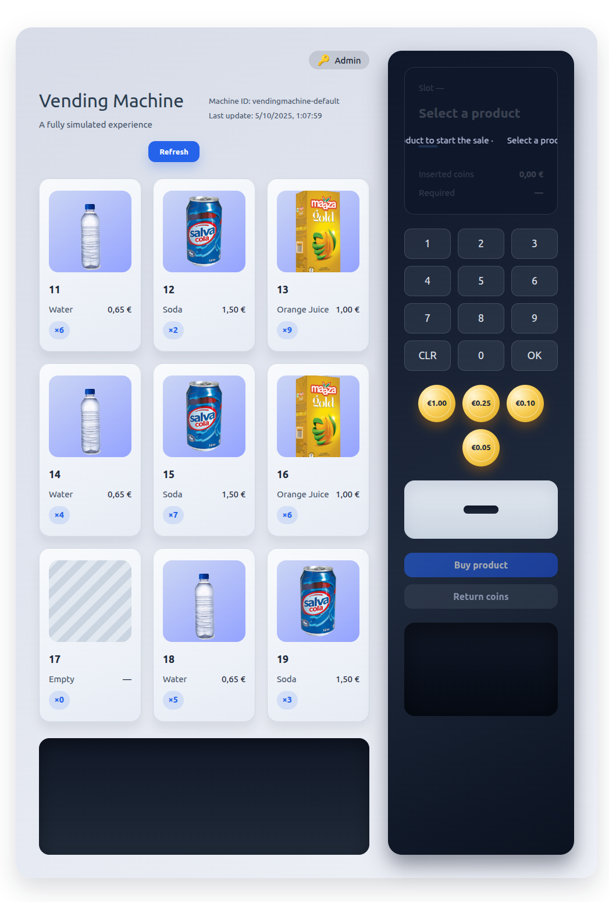
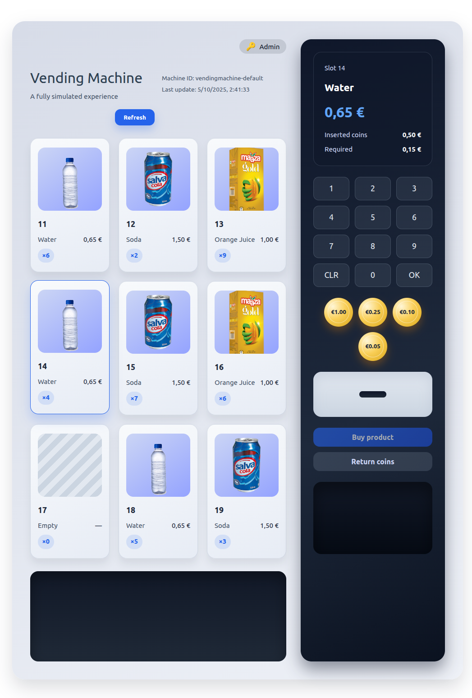
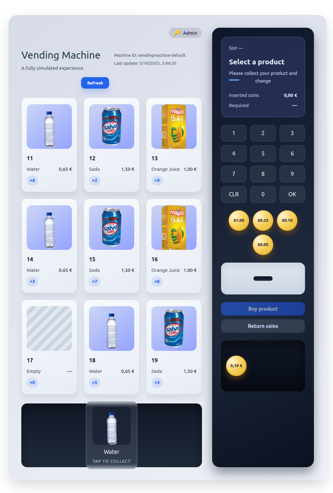
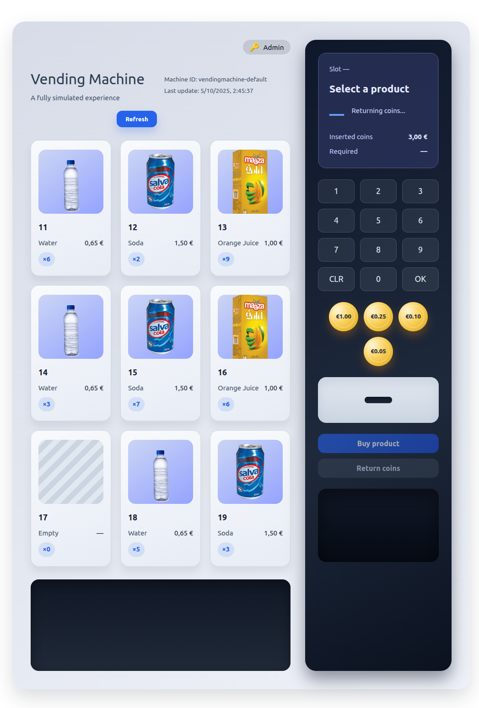
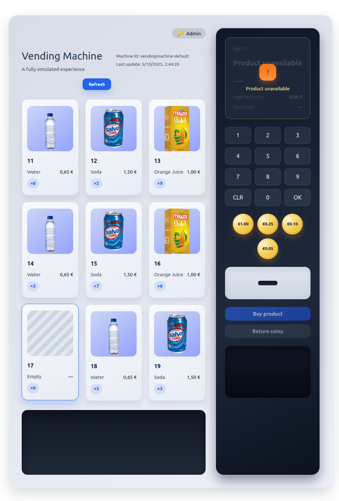
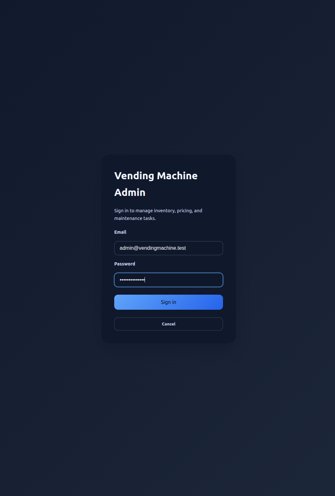
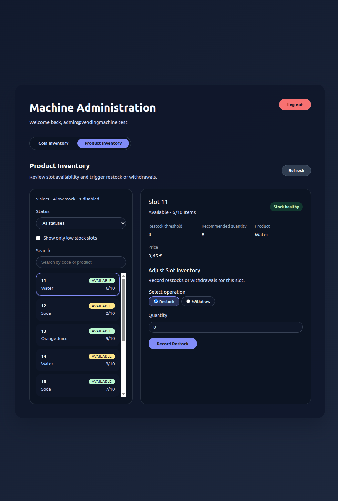
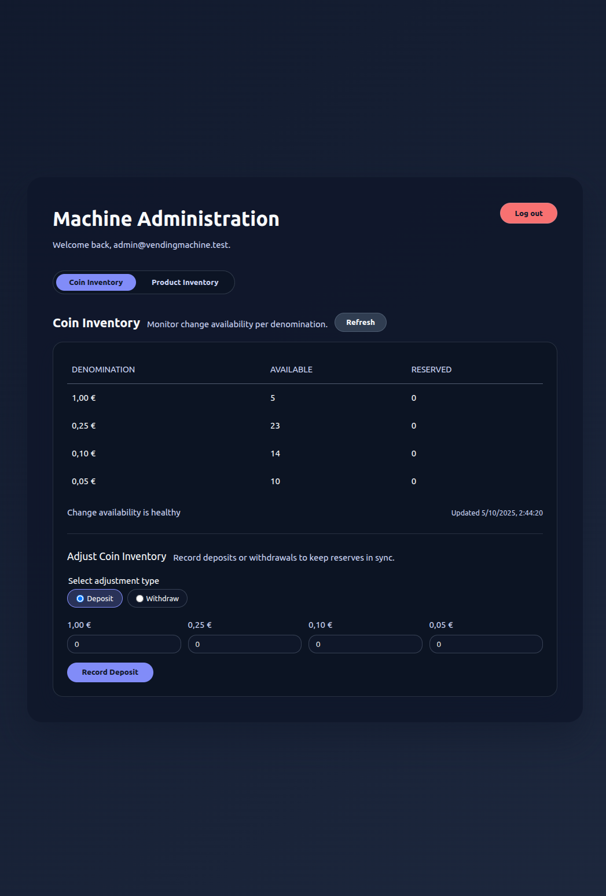

# vending-machine
Full vending machine simulation: customer purchases and administrative management. Vue.js frontend + Symfony API backend. Docker + MongoDB + Redis.


## Local Requirements
- **Docker Engine + Compose**: The entire stack (backend, frontend, databases) runs inside containers. Install Docker Desktop (macOS/Windows) or Docker Engine with the Compose V2 plugin (Linux). Ensure you can execute `docker compose version` successfully.
- **GNU Make**: CLI helper used for the project shortcuts (`make backend-ci`, `make backend-seed`, etc.). On macOS it ships with the developer tools (`xcode-select --install`); on Linux install via your package manager; on Windows use Git Bash, WSL.
- **Git** (optional but recommended): to clone the repository and manage branches.


## Getting Started
1. Clone the repository and copy environment variables:
   ```bash
   git clone git@github.com:CarlosEstebanCasado/vending-machine.git
   cd vending-machine
   cp .env.dist .env
   cd backend
   cp .env.dev .env
   ```
   Generate admin JWT secrets (optional but recommended):
   ```bash
   ./scripts/setup-admin-jwt.sh
   ```
   Or via Make (after cloning): `make setup-admin-jwt`
   
   You can pass a different env file (e.g. `.env.dist`) as the first argument if needed.
2. Add the local domain entry (run with elevated permissions):
   - macOS/Linux:
     ```bash
     sudo ./scripts/setup-host-entry.sh
     ```
   - Windows (PowerShell as Administrator):
     ```powershell
     ./scripts/setup-host-entry.ps1
     ```
3. Install backend dependencies (runs inside Docker):
   ```bash
   docker compose --profile dev run --rm backend composer install
   ```
   Or via Make: `make backend-install`
4. Install frontend dependencies (runs inside Docker):
   ```bash
   docker compose --profile dev run --rm frontend npm install
   ```
   Or via Make: `make frontend-install`
5. Launch the development stack with Docker (gateway proxy, Symfony, Vite, MongoDB, Redis):
   ```bash
   docker compose --profile dev up --build -d
   ```
   Or via Make: `make docker-build-up`
6. Seed the sample machine state (products, slots, coin inventory) so the UI/API have data:
   ```bash
   docker compose --profile dev run --rm backend php bin/console app:seed-machine-state
   ```
   Or via Make: `make backend-seed`
7. Access the services:
   - SPA: http://vendingmachine.test
   - API: http://vendingmachine.test/api/health
   - MongoDB: `mongodb://localhost:27017/vending_machine`
   - Admin login endpoint: http://vendingmachine.test/admin
     - Default credentials (seed data): `admin@vendingmachine.test` / `admin-password`

8. Stop the stack:
   ```bash
   docker compose --profile dev down
   ```
   Or via Make: `make docker-down`
## Functional Overview
- **Customer Experience:** Insert coins with live balance feedback, cancel for an automatic return, or approve the vend and receive exact change while browsing a catalog that highlights availability and low-stock/change alerts.
- **Admin Operations:** Access a backoffice dashboard to watch slot inventory and change coin reserves, curate the product catalog (activate/deactivate, set slot recommendations), and restock or adjust balances with full audit trails. Slot products can only be swapped once their stock hits zero, and neither stock nor pricing can be altered while a customer has a reservation in progress.

## Quality & Tests
- `make backend-ci`: runs the full backend pipeline inside Docker (composer validate, clean install, lint, PHPStan, PHPUnit with `APP_ENV=test`).
- `make frontend-ci`: mirrors the frontend flow in the container (`npm ci`, lint, type-check, tests, build).
- `./scripts/run-backend-ci.sh`: host-friendly mirror of the GitHub Actions workflow without Make.
- Coverage: PHPUnit exercises the main bounded contexts (machine, sessions, inventory); application tests rely on Mother factories to keep fixtures consistent and expressive.

## Tech Stack & Layout
- **Backend (`backend/`)** – Symfony 6 + PHP 8.3, organised by bounded contexts (`VendingMachine`, `AdminPanel`, `Shared`). Domain logic lives in `Domain`, use-cases in `Application`, and HTTP/CLI adapters in `UI`.
- **Frontend (`frontend/`)** – Vue 3 with Vite, featuring Composition API, Pinia stores, and module-based folders (`views`, `components`, `store`, `api`).
- **Infrastructure (`docker/`)** – Compose profiles for dev/prod, wiring Symfony, Vite, MongoDB, and an Nginx reverse proxy. Redis is provisioned inside the stack but currently unused by the application.
- **Tooling (`scripts/`, `Makefile`)** – Shell utilities for environment setup, seeding, CI mirroring, plus Make targets (`backend-ci`, `frontend-ci`, `backend-seed`, etc.).

## UI Preview
| Máquina en espera | Producto seleccionado | Insertando monedas |
| --- | --- | --- |
|  |  |  |

| Compra completada | Devolución de monedas | Producto sin stock |
| --- | --- | --- |
|  |  |  |

| Login admin | Inventario de productos | Inventario de monedas |
| --- | --- | --- |
|  |  |  |

## FAQ & Known Gaps
- **Are transactions stored long term?** Not yet. The API responds with the session summary and updates dashboards, but historical persistence/reporting remains on the roadmap.
- **Why ship Redis if it is unused?** It is provisioned for future caching/event work. The current runtime does not read or write to Redis.
- **How do admin adjustments behave with active purchases?** Slots lock while a customer has a selection. Stock or product swaps only resume once the purchase completes or the selection is cleared, and slot products can be reassigned only after their stock reaches zero.

## Security & Resilience
- Secrets (APP, Mongo, JWT) live in environment variables (`.env.dist` documents the defaults); production deployments override them securely.
- Admin authentication is stateless: the `/api/admin/login` endpoint issues HS256 JWTs via `JwtAdminTokenService`, and the `AdminJwtAuthenticator` validates signature, expiry, and required claims on every admin request.
- Passwords leverage Symfony's password hashers; inactive admins are rejected before issuing tokens.
- JSON errors are normalized through `JsonExceptionSubscriber`, so domain/validation issues surface as structured 4xx/5xx responses.
- Inventory invariants prevent accidental race conditions: slot stock and coin reserves cannot be edited while a customer reservation is active, and a slot swap only happens once the previous product is exhausted.

## Domain Models
- `Money` & value objects (`Coin`, `CoinBundle`, `MoneyBalance`): safe arithmetic around accepted denominations, feeding balance tracking and change planning.
- `Product`: immutable identity with mutable SKU/name/status/price/recommended slot quantity. Application services enforce that repricing or swapping only happens when no active reservation is holding the slot.
- `InventorySlot`: couples a product to a physical compartment with capacity, quantity, restock threshold, and status (`available`, `reserved`, `disabled`). Guards ensure quantities never exceed capacity and block product changes while stock remains.
- `CoinInventory`: manages available vs. reserved change bundles. Supports deposit/withdraw/reserve flows and greedy change planning; when the greedy plan fails, the UI surfaces the “insufficient change” warning.
- `VendingSession`: orchestrates customer interactions (collecting → ready → dispensing/cancelled/timeout) while keeping inserted coins, balance, selected product, change plan, and close reason internally consistent.
- `AdminUser`: models backoffice accounts (id, email, hashed password, roles, active flag). Login issues HS256 JWTs via `JwtAdminTokenService`, and the authenticator validates signature, expiry, and claims on each request.

## MongoDB Schema
All monetary amounts are stored in cents (`int32`). Collections managed by Doctrine ODM:

### Collection: `products`
- `_id` (`string`) — product UUID
- `sku` (`string`)
- `name` (`string`)
- `price_cents` (`int32`)
- `status` (`string`) — `active` | `inactive`
- `recommended_slot_quantity` (`int32`)
- `created_at` / `updated_at` (`Date`)

### Collection: `inventory_slots`
- `_id` (`string`) — composite `machineId-slotCode`
- `machineId` (`string`)
- `code` (`string`)
- `capacity` (`int32`)
- `quantity` (`int32`)
- `restockThreshold` (`int32`)
- `status` (`string`) — `available` | `reserved` | `disabled`
- `productId` (`string|null`)
- `createdAt` / `updatedAt` (`Date`)

### Collection: `coin_reserves`
- `_id` (`string`) — machine id
- `available` (`hash`) — e.g. `{100: 5, 25: 10}`
- `reserved` (`hash`)
- `insufficientChange` (`bool`)
- `updatedAt` (`Date`)

### Collection: `machine_sessions`
- `_id` (`string`) — machine id
- `sessionId` (`string|null`)
- `state` (`string`) — mirrors `VendingSessionState`
- `balanceCents` (`int32`)
- `insertedCoins` (`hash`)
- `selectedProductId` (`string|null`)
- `selectedSlotCode` (`string|null`)
- `changePlan` (`hash|null`)
- `updatedAt` (`Date`)

### Collection: `machine_slots`
- `_id` (`string`) — `machineId-slotCode`
- `machineId` (`string`)
- `slotCode` (`string`)
- `productId` (`string|null`)
- `productName` (`string|null`)
- `priceCents` (`int32|null`)
- `quantity` (`int32`)
- `capacity` (`int32`)
- `status` (`string`)
- `lowStock` (`bool`)
- `recommendedSlotQuantity` (`int32`)

### Collection: `machine_coin_inventory`
- `_id` (`string`) — machine id
- `available` (`hash`)
- `reserved` (`hash`)
- `insufficientChange` (`bool`)
- `updatedAt` (`Date`)

### Collection: `admin_users`
- `_id` (`ObjectId`)
- `email` (`string`)
- `passwordHash` (`string`)
- `roles` (`array<string>`) — default `['admin']`
- `active` (`bool`)
